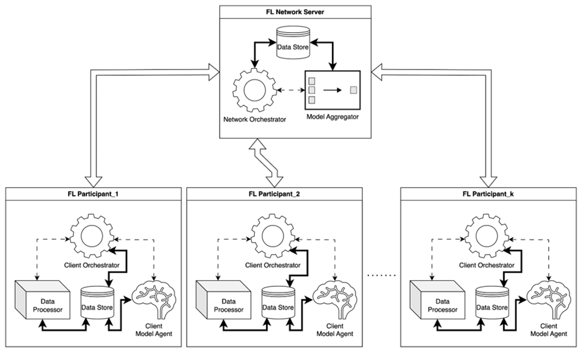

# Aikya

- [License](#license)
- [Notice](#notice)
- [Notes and Contribution](#notes-and-contribution)
- [Introduction](#introduction)
  - [Overview](#overview)
  - [Industry Paper](#industry-paper)
  - [Quick Start Guides: Setup and running the experiments](#quick-start-guides-setup-and-running-the-experiments)
- [System Architecture](#system-architecture)
- [Sequence flow](#sequence-flow)

## License

AIKYA is licensed under Apache 2.0 license. Please refer to [LICENSE](./LICENSE) file.

## Notice

Please refer to the [NOTICE](./NOTICE) file for more details on third party software used as part of this repository.

## Notes and Contribution

We would like to highlight that Aikya is purely experimental and research code base, yet. Should this change, a notice reflecting the same will be posted.

- For now, this code is meant to be maintained only by the core development and maintenance team(s). Please do not raise PRs against this repository until this notice is taken down - they will be declined.
  - We have tried our best to sanitize the code of bugs - but it is impossible to cater to every edge case, especially in research style code bases. For now, please don't reach out to us for fixes. We will roll out fixes as and when we find them.
  - It is known that the code quality and performance is not optimal. Again, this will be dealt with in future versions as our efforts shape up.
- We recommend against using this codebase as a reference for any production applications. This repository is purely for validating claims as part of the industry paper on Decentralized AI Kinexys published and is offered without any guarantees.

## Introduction

### Overview

Project AIKYA is an exciting proof-of-concept (PoC) for federated learning, developed through a collaboration between Kinexys by J.P. Morgan and BNY. This exploration demonstrates the power of FL in institutional collaboration, proving that globally aggregated models can outperform individual ones by integrating the unique strengths that they each provide. This approach makes it a viable option for cross-border payments and other complex financial transactions. Following this PoC, several exciting directions are available to explore, including real-world data validation, scaling to multi-participant networks, testing FL models that support participants with heterogeneous technology stacks and/or model-agnostic networks, and testing across multi-region and multi-industry networks.

### Industry Paper

Please refer to the industry paper on Decentralized AI Kinexys published by J.P. Morgan and BNY Mellon for more details on the concepts and ideas behind this project: [Enhanced Anomaly Detection in Financial Transactions
through Decentralized AI](https://www.jpmorgan.com/kinexys/documents/kinexys-project-aikya-enhanced-anomaly-detection-through-decentralized-ai.pdf)

### Quick Start Guides: Setup and running the experiments

**⚠️ Aikya is a PoC and not meant for production usage**

- To build and run services locally, please refer to our [quickstart guide](./docs/quickstart-guide.md).
- To understand the experimental process and steps to run it yourself, please refer to [these instructions](./docs/run-experiment.md).

## System Architecture

The permissioned experimental FL setup employs a client-server architecture. Network Participants are clients, and the Network Server forms the server. Fig. 3 provides a high-level overview of the system architecture and components

## Sequence flow

All the experiments are entirely driven via the operations UI, ensuring reproducibility and traceability. Prior to interaction, sample datasets are loaded onto client nodes for the Data Processor service to ingest and reference in the database. Client UIs are accessible via unique URIs for each participant, with client systems physically isolated on distinct machines. All subsequent steps assume network bootstrapping is complete. The diagram below summarizes the sequence of flow visually. Please refer to the enumerated points for more details on each step.

